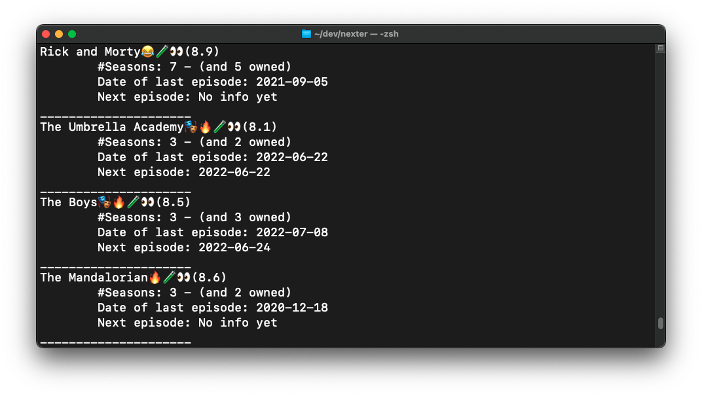
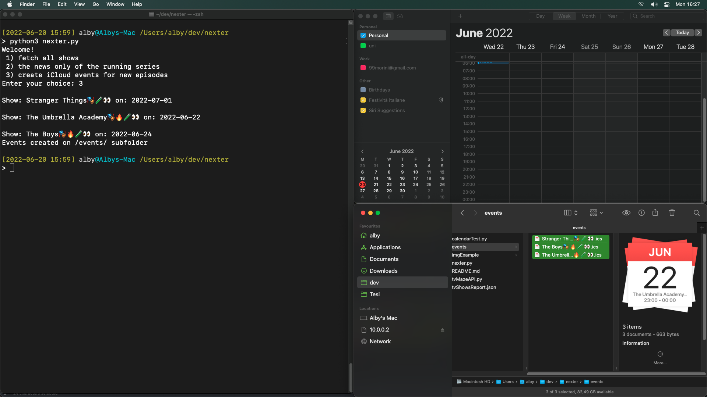
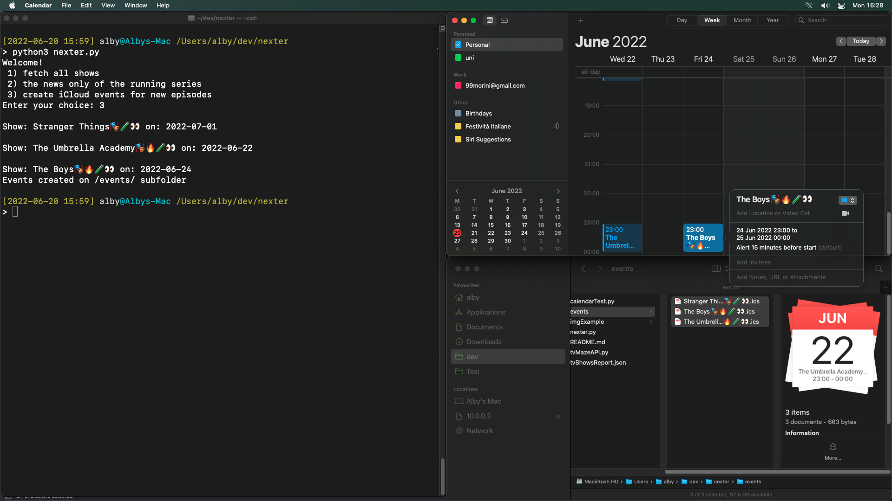

# Nexter a simply tv tracker.

Nexter gives you info about TvShows you're watching, like the date of next episode and will create an event on your calendar of it.

## The idea

Fed up of missing shows episode, I created this script which fetch on  <a href="https://tvmaze.com>">TvMaze</a> the date and create in my calendar the event (.ics, importend on my calendar by a script).

And, gives you info if there'll be another seasons or if the shows has been cancelled.

### Some example

### Calendar's event:

## Usage

`$ python3 nexter.py`

* option 1: show all tv series
* option 2: print just the running tv shows
* option 3: create an .ics file for each tv show having the date of the next episode, you have to manually open these file with your calendar app.

### Warning

1. I print some emoji in terminal (by kind of the show), this, could cause some problem if you haven't got any charset installer.
2. I assume a good structure of your media library: root > show > seasons > episodes
